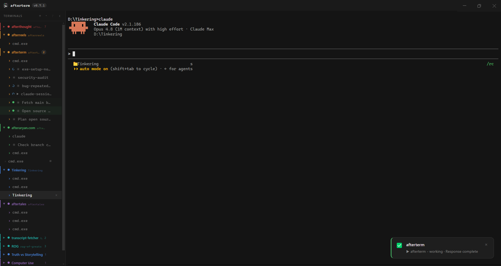

# afterterm

[](https://github.com/afteraryan/afterterm)

A terminal emulator for Windows with **Chrome-style tab groups**, built for running **multiple Claude Code sessions** side by side. Named, color-coded, collapsible groups of terminal tabs — plus first-class Claude Code notifications and session resume. No other terminal has this.

> ⚡ afterterm is **vibe coded** — built almost entirely through AI pair-programming
> (Claude Code). Expect that character: fast-moving, pragmatic, occasionally rough.

<!--
  Screenshot: drop an image at docs/screenshot.png (and optionally a docs/tab-groups.gif).
  A shot showing a few colored, named, collapsed tab groups in the sidebar sells the feature best.
-->


## Why

Every terminal lets you open a dozen tabs. None of them let you *organize* those tabs the way Chrome lets you organize browser tabs — into named, colored, collapsible groups you can drag around. afterterm does exactly that: drag one tab onto another to form a group, click the label to collapse it, drag the label to reorder. Your "frontend", "backend", and "infra" shells stay visually separate instead of becoming an undifferentiated wall of tabs.

A group is effectively a **project**: name it, color it, and point it at a folder — every new tab you open inside that group starts in that directory. So "frontend", "backend", and "infra" aren't just labels; each spawns its shells in the right repo automatically.

That layout matters most when you run **several Claude Code sessions at once** — one per project or task. afterterm treats Claude Code as a first-class citizen: it knows when a background session needs your attention, surfaces it without stealing focus, shows you which tabs are still working, and brings your sessions back after a restart.

## Features

- **Chrome-style tab groups** — drag to group, name + color them, collapse, reorder
- **Groups as projects** — give a group a working directory; new tabs in it open in that folder
- **Built for Claude Code** — notifications, live "working" indicators, and auto-resume for your sessions (see below)
- **Multiple shells** — auto-detects Command Prompt, PowerShell 7, Windows PowerShell, Git Bash, and WSL; pick which to open from the shell dropdown
- **Session restore** — reopens your tabs, groups, and working directories on relaunch
- **GPU-accelerated rendering** — xterm.js with a WebGL renderer (canvas fallback) stays smooth under heavy output
- **Keyboard-driven** — shortcuts for tabs, panel, find, and more — registered so they work even inside Claude Code, with an in-app cheatsheet
- **Terminal niceties** — clickable links (incl. OSC 8), find-in-scrollback, right-click copy/paste, per-tab font zoom, file drag-and-drop

## Built for Claude Code

afterterm is designed for the workflow of running many [Claude Code](https://www.claude.com/product/claude-code) sessions in parallel:

- **Notifications when a session needs you** — when a background tab finishes, asks for permission, or hits an error, afterterm shows an always-on-top overlay toast (even when the window is behind other apps) plus a pulsing indicator on the tab. Click the toast to jump straight to that session.
- **Live "working" indicator** — a spinner on a tab while Claude is mid-turn, so you can see at a glance which sessions are busy and which are waiting on you. Groups show a badge counting how many members need attention.
- **Session auto-resume** — tabs running a Claude Code session reopen it (`claude --resume`) in the right directory after an app restart.
- **Zero setup** — afterterm ships and self-installs its own Claude Code hook (idempotent, opt-out via a prefs flag) and stays a complete no-op in any terminal that isn't afterterm.

> None of this requires Claude Code — afterterm is a perfectly good general-purpose terminal — but it's where the design effort went.

## Install

Grab the latest self-extracting installer from the [Releases](https://github.com/afteraryan/afterterm/releases) page and double-click it. No unzip tool needed.

> Windows only. Built and tested on Windows 11.

## Build from source

Requires **Node.js** and **Windows** (afterterm uses ConPTY via node-pty).

```powershell
git clone https://github.com/afteraryan/afterterm.git
cd afterterm
npm install

npm start          # run in development
npm run build      # produce a portable build in out\afterterm-win32-x64\
```

## Tech stack

[Electron](https://www.electronjs.org/) · [xterm.js](https://xtermjs.org/) · [node-pty](https://github.com/microsoft/node-pty) · [React](https://react.dev/) · [@dnd-kit](https://dndkit.com/) for drag-and-drop.

node-pty runs in Electron's main process (holds the ConPTY handles); xterm.js renders in the renderer, with IPC between them. See [`CLAUDE.md`](CLAUDE.md) for the full architecture notes.

## Status

Early days — currently `0.x` and Windows-only. Expect rough edges.

## Contributing

Issues and PRs welcome — start at the [issue tracker](https://github.com/afteraryan/afterterm/issues).

## License

[MIT](LICENSE) © Aryan Saxena
