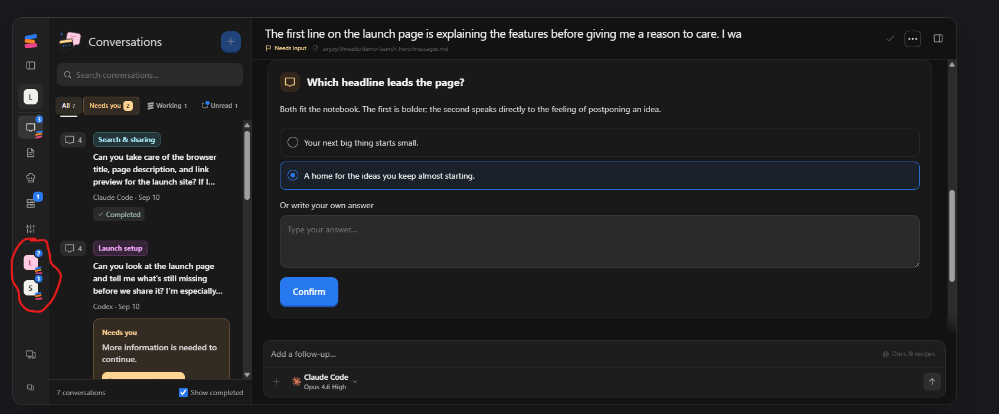

# Ideas for afterterm taken from looking at enjoy.dev

Written 2026-09-18, from Aryan's notes after trying the enjoy.dev demo and installing the app
on this machine. This file is the one place these notes live. Nothing here is decided or
scheduled: it is the raw list, sorted into buckets, so it can be turned into design work and
backlog items later. It is deliberately not merged into `docs/ideas.md`, `docs/bugs.md` or
`PHASES.md`.

The screenshot is Enjoy's workspace with its sidebar collapsed to the rail. The circled part
is what prompted most of bucket 1: two project tiles ("L" and "S") sitting on the always-on
rail, each with a badge saying how many of its threads need the user and how many are
working, visible no matter which project is open in the panel beside it.

## What enjoy.dev is, for context

Enjoy (enjoy.dev) is a desktop workspace for coding agents built by Mo Bitar, who previously
built Standard Notes. It runs Claude Code, Codex and Grok Build as child processes and shows
each session as a chat, not a terminal. Its pitch is "no terminal required". Free for one
project, a paid tier for unlimited projects plus phone and browser access. Mac and Windows.

Its layout is three columns: a project sidebar (collapsible to a rail), a list pane for the
current project's section, and a detail pane. Every project has five fixed sections:
Conversations, Docs, Recipes, Terminals, Project settings. The pieces relevant to this note:

- The rail keeps one tile per project with a needs-you count and a working count.
- The conversation list has filter tabs: All, Needs you, Working, Unread, each with a count,
  and a "Show completed" checkbox.
- A thread that needs the user shows an amber card in the list quoting the question the agent
  asked, with a "Respond" button.
- Thread states are Needs input, Working, Ready (finished, not yet acknowledged) and
  Completed. The thread menu has Mark as completed, Mark as unread and Delete.
- Search is a plain text input at the top of the list pane.
- Terminals in Enjoy are read-only log viewers with a Stop button, not real shells.
- Docs is a full rich-text editor with a card grid, checklists, a raw/rich toggle and a word
  count.
- Every thread is also a markdown file inside the project folder
  (`.enjoy/threads/<id>/messages.md`), shown as a path in the thread header.

Enjoy's own audience is people who do not want a terminal. afterterm's is people who live in
one. The buckets below are what transfers and what does not.

## Bucket 1: the sidebar and navigation, the main theme

This is where nearly all of the wanted ideas sit. Four entries already logged in
`docs/bugs.md` are symptoms of the same problem this bucket addresses: pinned and unpinned
projects read as one block, there is no collapse-all toggle, working threads are hard to find,
and an unpinned active project does not rise in the list.

### An always-on rail, VS Code style

A narrow rail that never goes away, with one tile per project showing its initial. Opening a
project shows its thread panel beside the rail. The rail stays put while the panel changes.
This is how VS Code keeps its activity bar while the explorer, search and extensions panels
swap in the space beside it. Today afterterm is one or the other: the full sidebar, or the
rail, toggled with Ctrl+Shift+B, never both at once.

### Attention badges on the rail tiles

Each project tile carries counts: how many of its threads need the user, how many are working.
Aryan called this "crazy good" because it answers "what needs me" without opening anything,
from any screen. Today afterterm has these counts as the bell and play pills on a project row,
but only inside the expanded sidebar, and only for the rows that fit.

### The rail shows only projects that need attention

Added by Aryan on 2026-09-18 after the first sort of these notes. The rail should not list
every project. A project tile appears on the rail only when something in it needs the user:
a thread that finished a turn (done, not yet viewed) or a thread waiting on the user (a
permission prompt, a question, anything the agent is stuck on). A project with nothing
pending is not on the rail. This is a stricter rule than the "current projects" rule below
and it is about the rail specifically, not the expanded sidebar.

### Only current projects in the expanded sidebar

Not every project, only the ones being worked on. Candidates for "current": pinned, or has
awake threads, or was recently worked on. The exact rule is not decided. Aryan's floor is
"awake threads or the projects I am working on".

### Bring a project in, close a project out

Some way to pull any other project into the sidebar on demand, and an easy way to close it
back out. Closing a project that still has awake threads asks first, roughly "N threads are
awake, closing will sleep them all". This is the same asks-first pattern the Phase 5 close and
sleep confirms already use for a thread with a listening port (`ConfirmDialog`).

### An attention filter over the thread list

All, Needs you, Working, Unread, each with a count, at the top of the thread list. Enjoy shows
these as tabs. In afterterm the underlying states already exist (`threadState` in
`src/renderer/threadView.ts` returns attention, working, done, running, asleep, quiet), so
this is a view over data the app already has, not a new notion of state.

### A thread that is waiting on the user stays "needs you" until it is actually answered

Added by Aryan on 2026-09-18. When an agent is waiting on the user (a permission prompt, an
AskUserQuestion, or a plain question in Claude Code's reply) the thread should keep its
needs-you state until the user has actually acted on it. Opening the thread, looking, and
going back without answering must not clear it: the agent is still stuck on the user.

Today the opposite happens: `handleActivate` in `src/renderer/app.tsx` clears a thread's
notification the moment it is selected, so a glance counts as an answer. The change is to
stop clearing on activation and clear only when the state genuinely moves on: the hook
reports a new state (the `▶ working` title from `UserPromptSubmit`, `✅` from `Stop`), or the
PTY output resumes after the pause, which is the same re-arm signal `spinnerState.ts` already
uses to flip attention back to working. One thing to design carefully: keystrokes echo as
output, so browsing a question's options with the arrow keys would count as output resuming.
Whether that should count as "acted on" or whether only the hook's next event should clear
it is an open question for the design.

### Mark a chat thread as unread

Added by Aryan on 2026-09-18. A way to mark a chat thread (not a terminal) as unread, so it
comes back to attention and he knows he has to return to it. Enjoy has this as "Mark as
unread" in the thread menu, and a matching Unread filter tab. In afterterm this would be a
new entry in the one thread menu (`threadMenu.tsx`), a persisted flag on the thread, and a
state the sidebar row, the rail badge and the attention filter all count. It is the manual
counterpart of the previous item: one keeps attention until answered, the other lets the
user put attention back on purpose.

## Bucket 2: small UI polish

- The Search row in the sidebar is a button with a shortcut label. It should be a real search
  input, the way Enjoy's is, with the palette's matching behind it.
- The shortcut labels on the New thread row and the others could be smaller or fewer. Fine
  to leave as they are for now.

## Bucket 3: nice to have, not a priority

### Docs per project, viewing only

See each project's docs from inside afterterm. Viewing, no fonts, no sizes, no editor
toolbar: Enjoy's full editor is explicitly not wanted. Aryan still wants to think about what
shape this takes before anything is built.

### Resume a closed chat from the UI

Aryan is unsure whether this adds value or clutter, and it is not a priority because with
Claude Code it is rare to return to a conversation whose work is done. One fact to check
before deciding: Phase 4 already built this for project threads. A closed thread in a project
goes to the project page's History tab with a Resume button that runs `claude --resume` in the
saved cwd. Only a closed thread in General is gone for good. Phase 4 has not been manually
tested yet, so it may already be what is wanted.

## Bucket 4: explicitly not wanted

- Replacing terminals with a chat UI. Terminals stay the centre of afterterm. This is the one
  thing Aryan thinks Enjoy got wrong.
- A full docs editor with fonts and sizes.
- Message snippets from the agent or the user shown in the sidebar or the thread list. Enjoy
  shows the first prompt as the title and quotes the agent's question in a card. Called a
  distraction, definitely not wanted.
- Any drastic redesign of afterterm now. Pick ideas from this list, do not rebuild around it.

## How this could turn into work

Not decided, only a suggested order for the discussion:

1. Bucket 1 is one design, not six features, and it overlaps with four open entries in
   `docs/bugs.md`. It wants a design note (a `design-03-...` file) agreed with Aryan before
   any code, in the same way design-02 preceded the projects-and-threads phases.
2. "Stays needs-you until answered" and "mark as unread" are the two smallest pieces and
   change existing state logic rather than layout. They could ship ahead of the layout work.
3. Bucket 2's search input is a one-component change.
4. Bucket 3 waits.
